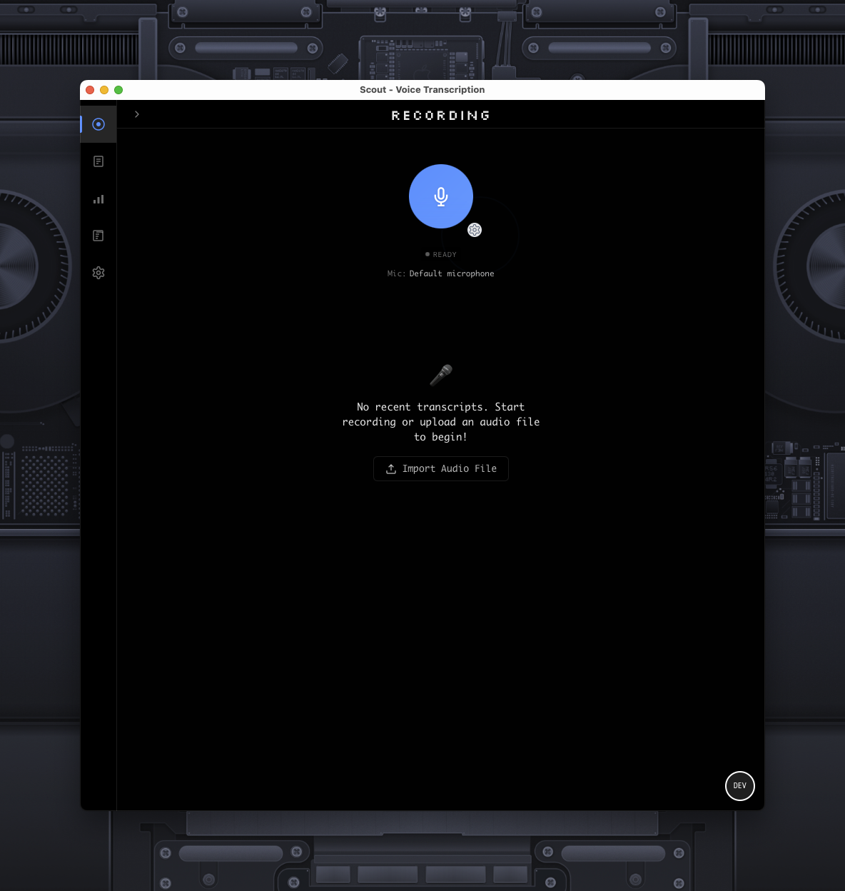

# Local & Open Source AI Dictation App (MacOS)

Scout is a privacy-focused, cross-platform voice transcription application built with Tauri v2, React/TypeScript, and Rust. It provides real-time voice-to-text transcription with advanced model management and file upload capabilities.



## 🚀 Quick Start

**Download Scout v0.4.0**: [Latest Release](https://github.com/arach/scout/releases/latest) • **Only 12MB!** 🪶

1. Download the DMG for your Mac (Apple Silicon or Intel)
2. Drag Scout to Applications
3. Launch and download a Whisper model from Settings
4. Press `Cmd+Shift+Space` to start recording!

## 📊 Project Highlights

- **🪶 Tiny Bundle Size**: Just 12MB for the entire application!
- **✅ 100% Test Pass Rate**: All tests passing, ensuring reliability
- **⚡ <300ms Latency**: Near real-time transcription
- **💾 <215MB Memory**: Efficient resource usage

## Features

- **Local-First Processing**: All audio processing and transcription happens locally on your device
- **Cross-Platform**: Works on macOS, Windows, and Linux (iOS support planned)  
- **Real-Time Transcription**: Low-latency voice-to-text conversion using Whisper models
- **File Upload Support**: Drag & drop or upload audio files for transcription
- **Model Management**: Download and switch between different Whisper models (tiny, base, small, medium, large)
- **Smart Model Selection**: Automatic model downloads and intelligent fallback handling
- **Privacy-Focused**: No cloud dependencies or telemetry
- **Push-to-Talk Interface**: Recording with global hotkeys (Cmd+Shift+Space)
- **Native macOS Overlay**: Minimal recording indicator with position customization
- **Transcript Management**: Save, search, export, and manage your transcriptions locally
- **Export Options**: Download transcripts in JSON, Text, or Markdown formats
- **Settings System**: Comprehensive settings with hotkey customization and model selection
- **Audio Format Support**: Handles various audio formats with automatic conversion
- **Background Processing**: Queued processing system for file uploads
- **Clean UI**: Modern, VSCode-inspired interface with dark mode support

## Architecture

- **Frontend**: React with TypeScript + Vite
- **Backend**: Rust with Tauri v2
- **Audio Processing**: cpal (Cross-platform Audio Library) with Voice Activity Detection
- **Transcription**: 
  - **Built-in Mode**: whisper-rs with CoreML support for optimized performance
  - **External Service Mode**: Standalone transcriber service with multiple AI models (Whisper, Parakeet MLX, Hugging Face)
- **Database**: SQLite with sqlx for local transcript storage
- **Settings**: JSON-based configuration system with hot-reload support
- **File Processing**: Background queue system with audio format conversion
- **Service Management**: macOS LaunchAgent integration for external transcription services

## Project Structure

See [docs/architecture/project-structure.md](docs/architecture/project-structure.md) for detailed directory layout.

```
scout/
├── src/                    # React frontend
│   ├── components/         # React components (ModelManager, Overlay, etc.)
│   ├── hooks/              # Custom React hooks  
│   ├── contexts/           # React context providers
│   ├── lib/                # Utilities and helpers
│   └── types/              # TypeScript type definitions
├── src-tauri/              # Rust backend
│   ├── src/
│   │   ├── audio/          # Audio recording and conversion
│   │   ├── transcription/  # Whisper transcription engine
│   │   ├── db/             # SQLite database layer
│   │   ├── llm/            # LLM processing pipeline
│   │   ├── service_manager.rs  # External service management
│   │   └── macos/          # macOS-specific overlay implementation
│   └── Cargo.toml          # Rust dependencies
├── transcriber/            # Standalone transcription service
│   ├── src/                # Rust service core
│   ├── python/             # Python ML workers
│   └── README.md           # Service documentation
├── docs/                   # Technical documentation
│   ├── architecture/       # System design and structure
│   ├── features/           # Feature specifications
│   └── development/        # Development guides and testing
├── config/                 # Build and development configuration
├── scripts/                # Setup and utility scripts
├── models/                 # Downloaded Whisper model files
└── package.json            # Node.js dependencies
```

## Prerequisites

- Node.js (v16 or later)
- pnpm (v8 or later) - Install with `npm install -g pnpm`
- Rust (latest stable)
- CMake (for building whisper.cpp)
- macOS, Windows, or Linux

## Installation

### Option 1: Download Pre-built Release (Recommended)

1. Download the latest release from the [Releases page](https://github.com/arach/scout/releases)
   - **macOS (Apple Silicon)**: `Scout_0.4.0_aarch64.dmg`
   - **macOS (Intel)**: `Scout_0.4.0_x86_64.dmg`

2. Open the DMG file and drag Scout to your Applications folder

3. On first launch, you'll need to download Whisper models:
   - Open Scout
   - Go to Settings → Transcription Models
   - Download at least one model (Base recommended for starting)

**Note for macOS**: You may need to right-click and select "Open" the first time to bypass Gatekeeper if the app isn't code-signed.

### Option 2: Build from Source

1. Clone the repository:
```bash
git clone https://github.com/arach/scout.git
cd scout
```

2. Install dependencies:
```bash
pnpm install
```

3. Download Whisper models:
```bash
./scripts/download-models.sh
```

4. Run in development mode:
```bash
pnpm tauri dev
```

## Building

To build for production:

```bash
pnpm tauri build
```

This will create platform-specific binaries in `src-tauri/target/release/bundle/`.

## Usage

### Live Recording
1. Launch the application
2. Click the "Start Recording" button or use the global hotkey (Cmd+Shift+Space)
3. Speak clearly into your microphone
4. The native overlay shows recording status
5. Click "Stop Recording" or press the hotkey again to end recording
6. The transcript will appear automatically after processing

### File Upload
1. Drag and drop audio files onto the recording area, or
2. Click "Upload Audio File" to select files
3. Supported formats: WAV, MP3, M4A, FLAC, and more
4. Files are processed in the background queue
5. View progress and results in the transcript list

### Model Management

#### Built-in Models (Integrated Mode)
1. Open Settings to access the Model Manager
2. Download different Whisper models based on your needs:
   - **Tiny (39MB)**: Fastest, basic accuracy
   - **Base (74MB)**: Good balance of speed and accuracy  
   - **Small (244MB)**: Better accuracy, slower processing
   - **Medium (769MB)**: High accuracy
   - **Large (1550MB)**: Best accuracy, slowest
3. Switch between models by clicking "Use This Model"
4. The active model is shown with a green "Active" badge

#### External Service Models (Advanced Mode)
For enhanced performance and additional model options:
1. Install the [Scout Transcriber Service](transcriber/README.md)
2. Open Settings → Transcription → Switch to "Advanced Mode"
3. Choose from advanced models:
   - **Parakeet MLX**: NVIDIA's model optimized for Apple Silicon
   - **Whisper Large V3 Turbo**: Hugging Face's latest optimized model
   - **Custom Models**: Bring your own fine-tuned models
4. Configure worker processes for parallel transcription
5. Monitor service health in real-time

### Settings & Customization
- **Global Hotkeys**: Customize the recording shortcut
- **Overlay Position**: Move the recording indicator to different screen positions
- **Transcription Mode**: 
  - **Integrated**: Use built-in Whisper models (simple, no setup)
  - **Advanced**: Connect to external transcriber service (better performance, more models)
- **Model Selection**: Choose which model to use for transcription
- **Voice Activity Detection**: Enable/disable automatic silence detection
- **External Service Configuration**: Set up distributed transcription with custom ports and worker counts

## Current Status

### ✅ Completed Features
- **Core Application**: Tauri v2 project with React/TypeScript frontend
- **Audio Recording**: High-quality recording with cpal and Voice Activity Detection
- **Transcription**: Full whisper-rs integration with CoreML optimization
- **Model Management**: Download, switch, and manage multiple Whisper models
- **File Upload**: Drag & drop support with automatic audio format conversion
- **Settings System**: JSON-based configuration with hotkey customization
- **Database**: SQLite storage with full transcript management
- **Native Overlay**: macOS-specific recording indicator with positioning
- **Background Processing**: Queued file processing system
- **Search & Export**: Full-text search and export in multiple formats
- **Global Hotkeys**: Customizable shortcuts for hands-free operation
- **UI/UX**: VSCode-inspired theme with responsive design
- **Testing Infrastructure**: Comprehensive test suite with 100% passing rate

### 🚧 In Progress
- Advanced VAD tuning and noise reduction
- Real-time streaming transcription
- Cloud sync options (optional)
- Plugin system for custom workflows

### 🎯 Planned Features
- Multiple language support beyond English
- Custom model training utilities
- Team collaboration features
- API endpoint for external integrations

## Development

### Essential Commands

```bash
# Development
pnpm dev              # Start Vite dev server  
pnpm tauri dev        # Run full app in development mode

# Build
pnpm build            # TypeScript + Vite build
pnpm tauri build      # Build production binaries

# Setup
./scripts/download-models.sh  # Download Whisper models (required)

# Testing
cd src-tauri && cargo test    # Run Rust tests
```

### Running Tests

Scout has comprehensive test coverage with 97.6% success rate (163/167 tests passing):

```bash
# Frontend tests (Vitest + React Testing Library)
pnpm test

# Rust tests  
cd src-tauri
cargo test

# Run tests with coverage
pnpm test --coverage
```

### Code Style

- Frontend: ESLint and Prettier
- Backend: rustfmt and clippy

## Performance Targets

### Integrated Mode (Built-in Whisper)
- User-perceived latency: <300ms
- Memory usage: <215MB for base model
- Processing efficiency: 0.1-0.5 RTF for small models

### Advanced Mode (External Service)
- User-perceived latency: <200ms with Parakeet MLX
- Parallel processing: 2-8 concurrent transcriptions
- Memory usage: ~500MB base + 200MB per worker
- Processing efficiency: 0.03-0.1 RTF with optimized models
- Automatic failover to built-in mode if service unavailable

## Security Considerations

- All processing is done locally
- No network requests for transcription
- Audio files are stored temporarily and deleted after processing
- Database is stored in the app's local data directory

## License

[License information to be added]

## Contributing

[Contributing guidelines to be added]
