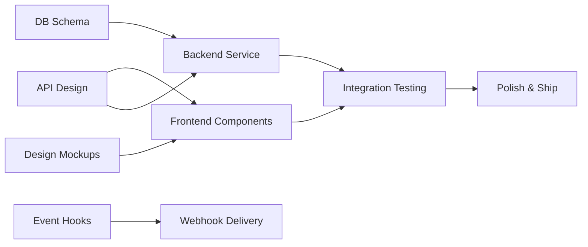

# Webhook Feature Timeline & Coordination

## Overall Timeline: 10 Days

### Phase 1: Design & Planning (Days 1-2)
**Owner**: Design Engineer
- [ ] Create UI mockups for webhook settings
- [ ] Design test flow and feedback states
- [ ] Define component specifications

**Owner**: Backend Engineer  
- [ ] Design database schema
- [ ] Define API contracts with Frontend
- [ ] Plan webhook service architecture

### Phase 2: Core Implementation (Days 3-7)
**Parallel Tracks**:

**Frontend Track** (Frontend Engineer):
- Day 3-5: Webhook Settings Component
- Day 4-5: Context & State Management
- Day 6: API Integration

**Backend Track** (Backend Engineer):
- Day 3-4: Webhook Service Implementation
- Day 5: CRUD Operations & Tauri Commands
- Day 6: Transcription Event Integration

**Design Support** (Design Engineer):
- Day 3-4: Log viewer designs
- Day 5: Error states and edge cases

### Phase 3: Integration & Polish (Days 8-9)
**All Teams**:
- [ ] Frontend-Backend integration testing
- [ ] UI polish based on implementation
- [ ] Error handling improvements
- [ ] Performance optimization

### Phase 4: Testing & Documentation (Day 10)
**All Teams**:
- [ ] End-to-end testing
- [ ] User documentation
- [ ] Code review and cleanup

## Critical Path Dependencies

## Key Milestones

### Day 2: Design Complete
- All mockups finalized
- API contracts agreed upon
- Database schema reviewed

### Day 5: Core Features Working
- Basic webhook CRUD operations
- Test webhook functionality
- Initial UI implementation

### Day 7: Feature Complete
- All functionality implemented
- Basic testing complete
- Ready for integration

### Day 10: Ship Ready
- All tests passing
- Documentation complete
- Feature ready for release

## Risk Mitigation

### Technical Risks
1. **HTTP Client Performance**
   - Mitigation: Implement connection pooling early
   - Owner: Backend Engineer

2. **UI State Complexity**
   - Mitigation: Use existing patterns from Scout
   - Owner: Frontend Engineer

3. **Large Payload Handling**
   - Mitigation: Set size limits, test with real data
   - Owner: Backend Engineer

### Schedule Risks
1. **API Contract Changes**
   - Mitigation: Lock down API design by Day 2
   - Owner: All Engineers

2. **Design Iterations**
   - Mitigation: Get feedback early and often
   - Owner: Design Engineer

## Communication Plan

### Daily Standups
- 15-minute sync at start of each day
- Focus on blockers and dependencies

### Key Sync Points
- **Day 2**: API Design Review
- **Day 5**: Integration Planning
- **Day 7**: Testing Strategy
- **Day 9**: Ship Decision

### Slack Channels
- #webhook-feature - General discussion
- #webhook-design - Design feedback
- #webhook-dev - Technical discussion

## Success Metrics

### Development Metrics
- [ ] All tasks completed on schedule
- [ ] Zero critical bugs at launch
- [ ] <2 second webhook delivery time
- [ ] 100% test coverage for critical paths

### Feature Metrics
- [ ] Feature works end-to-end
- [ ] Performance targets met
- [ ] Documentation complete
- [ ] Team satisfaction with process